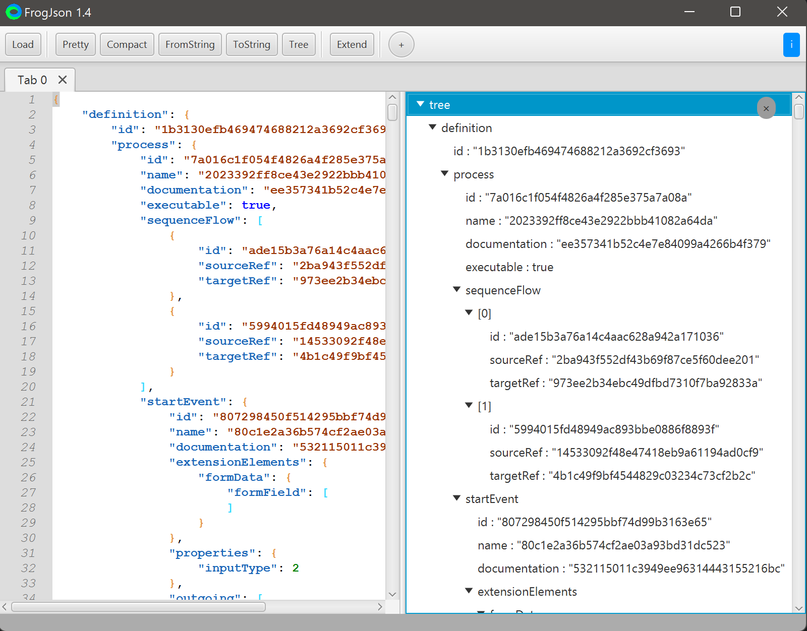

# FrogJson

## Overview

json tool. like this:



* Pretty: 格式化json;
* Compact: 压缩json, 以紧凑的格式输出;
* FromString: 将string数据(前后有双引号, 内部所有双引号都被转义)转为json, 类似于: javascript中的JSON.parse("xxxx");
* ToString: 将json转为字符串, 类似于: javascript中的JSON.stringify(xxx);
* Tree: 解析输出json树;
* 输入框: 用来给新建的tab指定名称.

环境要求: jdk11

## 开发计划

暂无

## 构建

```
mvn clean package
```

## 打包

这里使用launch4j-3.14进行打包, windows环境:

1. 运行launch4j:

```
java -jar launch4j.jar
```

> 不建议使用launch4j.exe启动, 在OpenJDK11下启动会报错

2. Basic页签配置

 * Output file - 配置输出文件路径以及文件名(需要加上.exe后缀)
 * Jar - 配置可执行jar文件, 即maven生成的```FrogJson-0.1-jar-with-dependencies.jar```
 * Icon - 配置程序图标, 图标资源在```resource\logo.png```目录中

3. JRE页签

Bundled JRE paths - 配置jre路径, 这里建议配置%JAVA_HOME%, 否则OpenJDK环境下无法启动.

4. 点击上方菜单栏的"齿轮", 保存配置文件到任意地方. launch4j会自动开始打包, 然后就可以用了.